# リーグ・オブ・レジェンド データベース & クイズアプリ

League of Legends Database & Quiz App

全172体のチャンピオン情報を網羅したデータベースと、自身の知識の限界に挑むサバイバルクイズを備えたWebアプリケーションです。

---

## プロジェクトの目的と背景

League of Legends（LoL）は非常に魅力的で奥深いゲームですが、初心者が躓きやすい「知識量の壁」が存在します。私自身、数ヶ月プレイする中で以下のような課題を感じていました。

* **圧倒的なチャンピオン数:** 170体以上のチャンピオンの名前やスキル、特徴を覚えるのが大変。
* **マッチングの待機時間:** マッチングやロード中の長い空き時間を有効活用して、楽しくゲームの勉強をしたい。
* **新規プレイヤーへのハードル:** 知識ゼロの友人にゲームを薦める際、遊びながら学べるツールがあればもっと誘いやすい。

これらの実体験から、 **「初心者がゲームの合間にサクッと遊べて、自然とLoLの知識が深まるアプリ」** を目指して本プロジェクトを開発しました。

また技術的な挑戦として、 **「外部APIからの複雑なデータ抽出・変換（バッチ処理）」「正規化されたデータベース設計」「SPA風のシームレスなフロントエンド体験」** までを一貫して設計・実装し、フルスタックなWebアプリケーション開発のスキルを実証しています。

---

## 主な機能

### 0. メイン画面

アプリのポータルとなるトップ画面です。公式クライアントをリスペクトした高級感のあるダークテーマで統一し、直感的に各機能へアクセスできるように設計しています。

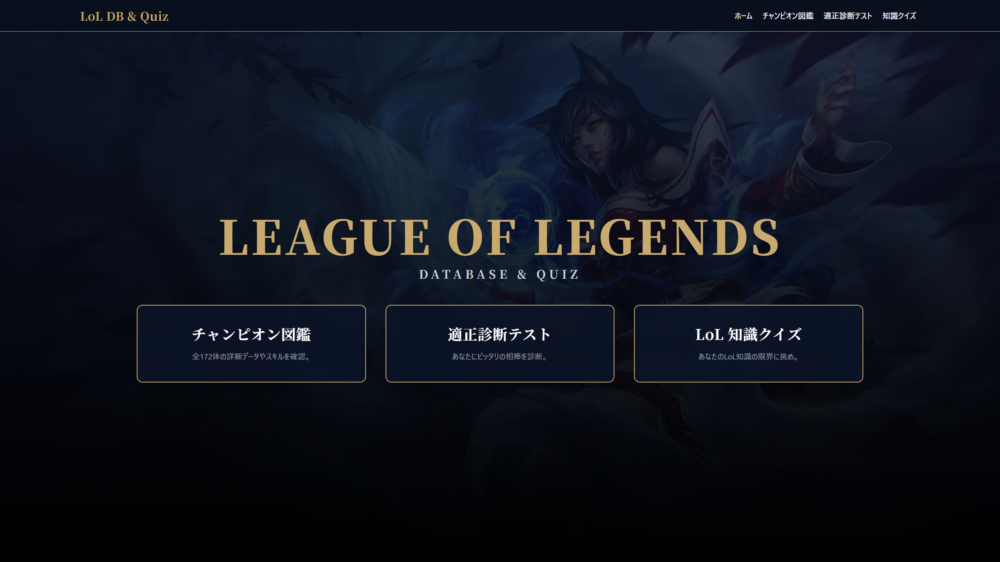

▲ メイン画面

### 1. チャンピオン図鑑

全172体のチャンピオンの詳細データを網羅的に閲覧できます。初心者がゲーム内で出会った「あのキャラは誰だ？」をすぐに解決できるように設計しています。

* **高速クロスフィルタリング:** ロール、適正レーン、地域、種族などの独自タグを用いた絞り込みと、リアルタイムな名前検索。
* **リッチな詳細モーダル:** 選択するとモダンなモーダルが開き、基礎ステータスやスキル情報（Passive/Q/W/E/R）をインタラクティブに確認できます。

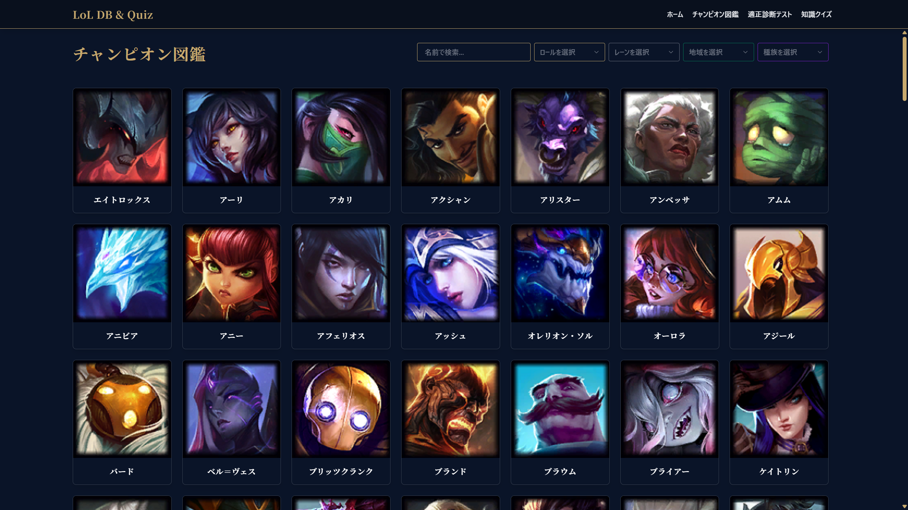 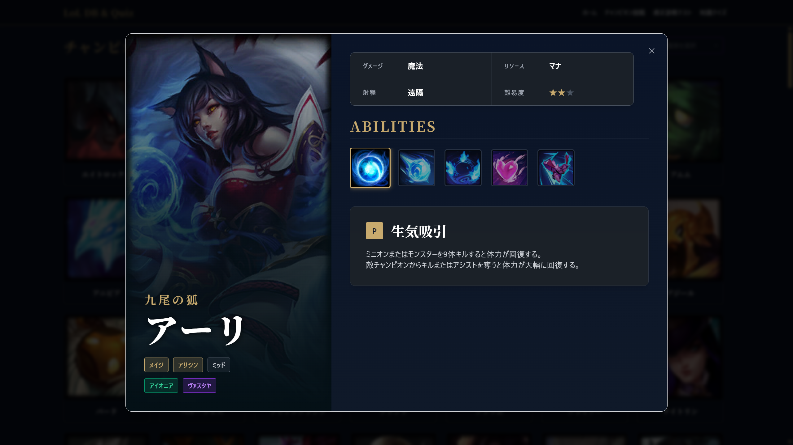

▲ 図鑑一覧画面（左） / 詳細モーダル画面（右）

### 2. 適性診断テスト

「どのキャラクターから練習すればいいかわからない」という初心者の悩みを解決するため、ユーザーの性格や好みのプレイスタイルに関する質問から、独自の「属性スコアリングアルゴリズム」を用いて最適なチャンピオンを提案します。

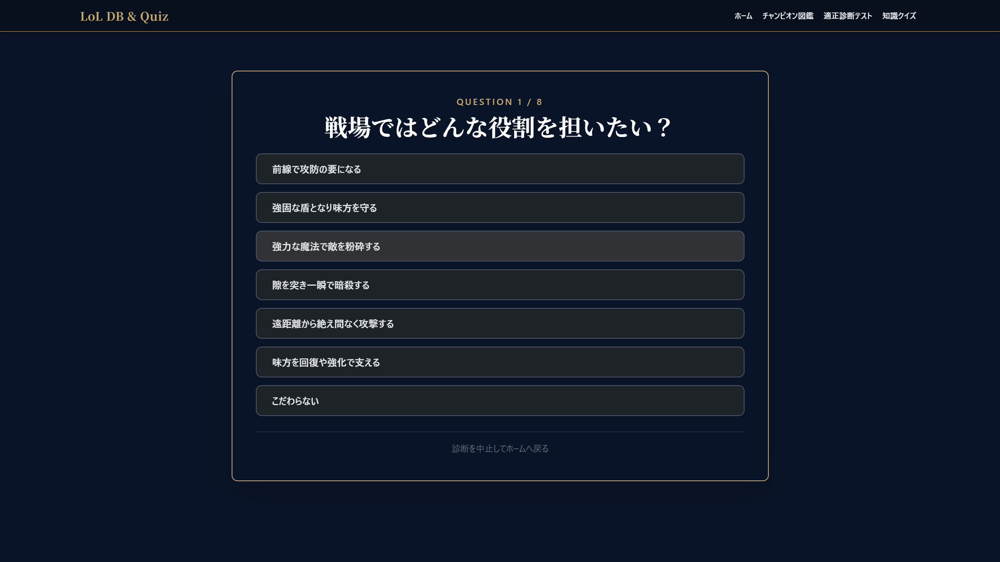 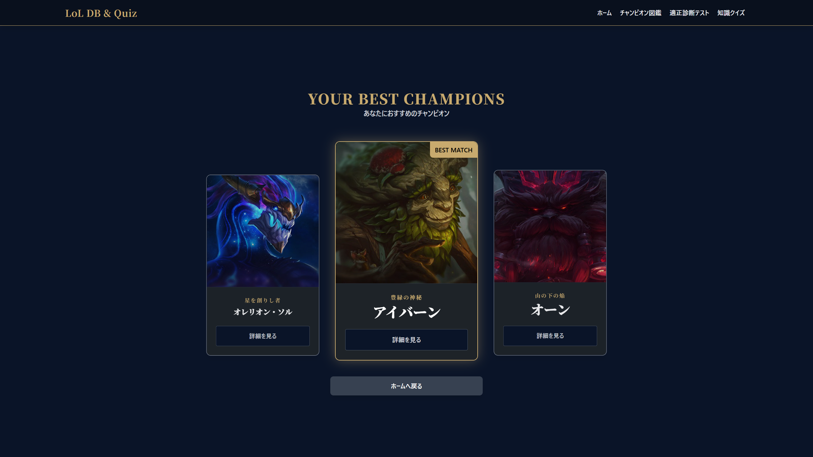

▲ 診断テスト画面（左） / おすすめチャンピオン結果画面（右）

### 3. LoL知識クイズ

データベースの情報をフル活用し、無限にランダム生成されるクイズに挑戦するエンドレスモードです。マッチングの待ち時間などにゲーム感覚で知識を吸収できます。

* **モード選択:** ジャンル（ビジュアル、スキル、その他知識）と難易度（NORMAL / HARD）を選択可能。
* **多彩な出題形式:** スプラッシュアート当て（HARDモードでは極限ズーム）、スキルアイコン当て、所属地域、ダメージ種別など、多様な角度から知識を問います。
* **キルストリーク演出:** 連続正解数に応じて「KILLING SPREE」から「LEGENDARY」まで、本家ゲームさながらの演出が画面を彩ります。
* **ランク評価システム:** 最終スコアに応じて、アイアンからチャレンジャーまでの公式ランクエンブレムによる評価が行われます。

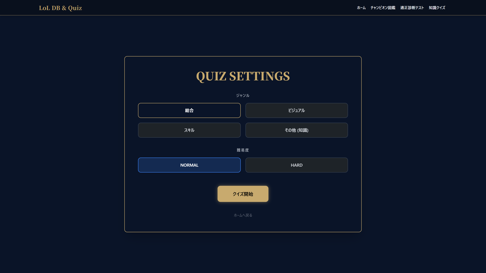

▲ クイズ設定画面

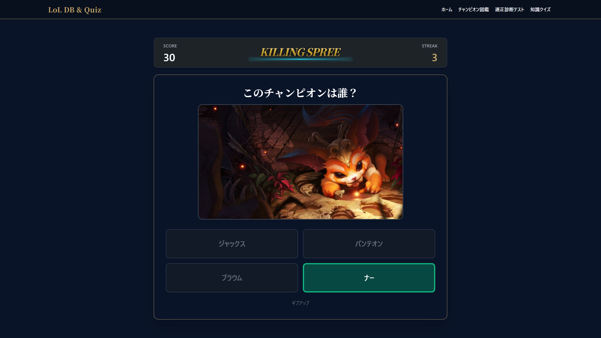 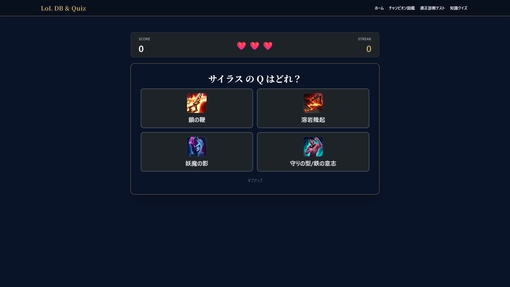

▲ クイズ画面：ストリーク演出（左） / スキル当てクイズ（右）

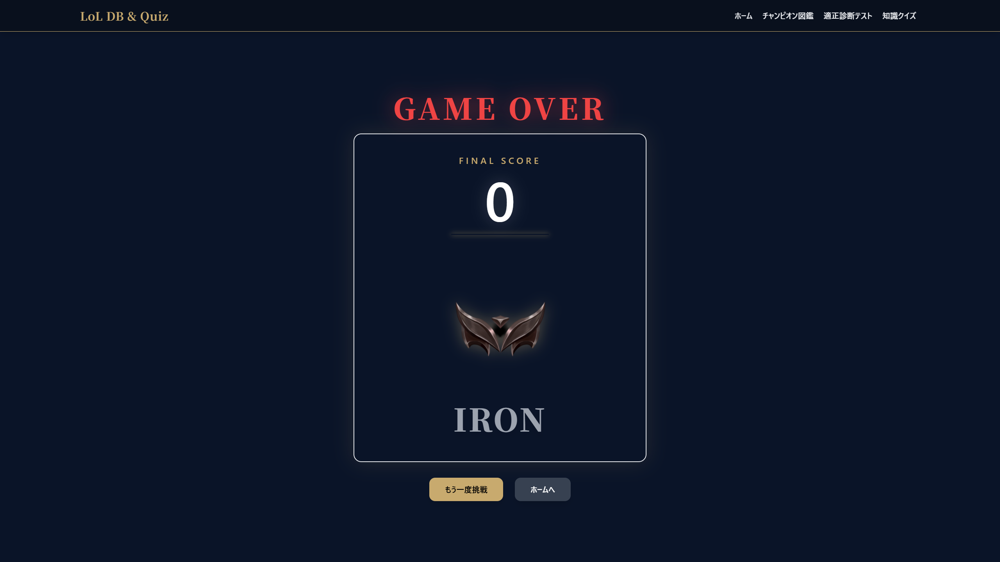 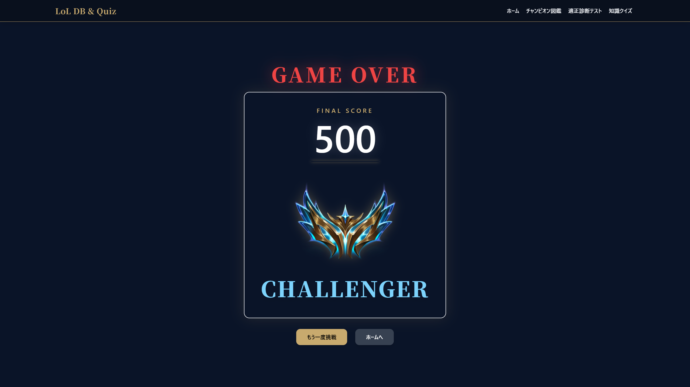

▲ 結果画面：低得点例（左） / 高得点例（右）

---

## アーキテクチャとこだわりのポイント

### 徹底したUI/UXへの追求と「統一感」

膨大なデータ（172体のチャンピオン情報や複雑なスキルなど）を扱うため、「いかにユーザーが迷わず、ストレスなく情報を探せるか」を最優先しました。**ユーザビリティ**の面では緻密な余白調整とTailwind CSSを活用したレスポンシブデザインを採用。**デザインの一貫性**においては、紺とゴールドを基調とした公式クライアント風の世界観で、アプリ全体のトーン＆マナーを統一しています。

### データ抽出・変換の完全自動化パイプライン

Riot公式のAPI（Data Dragon）から最新パッチのデータを自動取得し、正規化されたデータベースへ変換するJava製バッチツール（`ImageDownloader.java`, `DataDragonConverter.java`）を自作しました。パッチ更新への迅速な対応とメンテナンス性を両立しています。

### JPAを用いた正規化データベースとスコアリングアルゴリズム

チャンピオンの基本情報とタグ情報を別テーブルに分離し、多対多（Many-to-Many）のリレーションシップを構築。これにより、適性診断機能において「特定の属性を持つチャンピオンにポイントを加算する」という複雑なスコアリング計算を柔軟かつ正確に行うことを可能にしています。

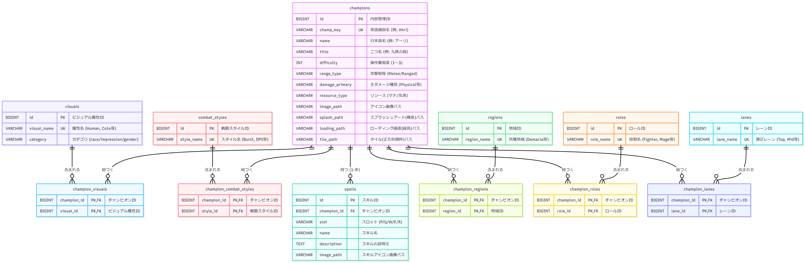

▲ データベースのER図

### SPAライクなシームレスUIとリッチアニメーション

単一の `index.html` 上でJavaScriptによる非同期データ取得とクラス制御を行い、SPA風のサクサク動く画面遷移を実現しました。また、クイズ中のキルストリーク演出では、JavaScriptを用いてブラウザの再描画を意図的に発生させ、CSSの transition と transform を動的に制御することで、滑らかでダイナミックなアニメーションを実装しています。

### AI駆動開発の実践

開発パートナーとして Gemini 3.1 Pro を活用しました。複雑なスコアリングロジックの構築、ミリ単位のCSSレイアウト調整、JPAのリレーション設計など、高度な技術的課題をAIとの対話を通じてアジャイルに解決し、短期間でのフルスタック開発を実現しました。

---

## 技術スタック

* **Backend:** Java 17 / Spring Boot 3.x / Spring Web / Spring Data JPA / H2 Database / Jackson
* **Frontend:** HTML5 / CSS3 / Vanilla JavaScript (ES6+) / Tailwind CSS
* **Data Source & Tools:** Riot Games API (Data Dragon) / Community Dragon
* **AI Support:** Gemini 3.1 Pro

---

## ローカルでの起動方法

本アプリケーションをローカル環境で実行する手順です。

### 必須要件

* Java 17 以上
* Maven 3.6 以上

### インストール・起動手順

1. リポジトリをクローンします:

~~~bash
git clone https://github.com/summer-543/lolapp.git
cd lolapp
~~~

1. Mavenラッパーを使用してSpring Bootアプリケーションを起動します:

~~~bash
./mvnw spring-boot:run
~~~

> Windowsの場合は `mvnw.cmd spring-boot:run` を実行してください。

1. 起動後、ブラウザで以下のURLにアクセスしてください:
   [http://localhost:8080](http://localhost:8080)

> **Note:** データベース（H2）はインメモリで動作しており、アプリ起動時に自動的にCSVデータを読み込んでテーブルを構築します。事前のDB構築作業は不要です。

---

## 今後の展望

* アプリのデプロイ。
* アイテムデータベースの解析と統合、アイテム関連クイズの追加、ビルドシミュレーターの実装。
* ルーンやサモナースペルのデータベースの解析と統合、ルーンやサモナースペル関連クイズの追加。
* プレイヤーの戦績API（Riot API）との連携。
